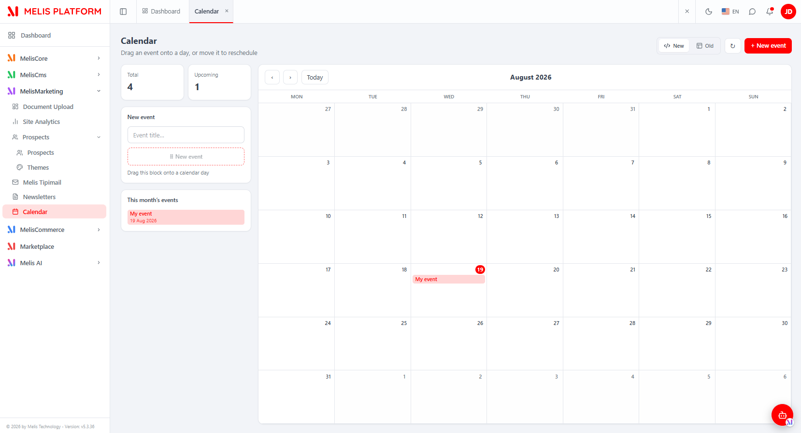
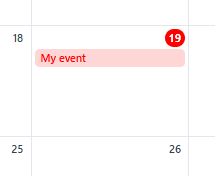
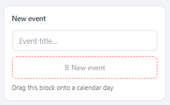
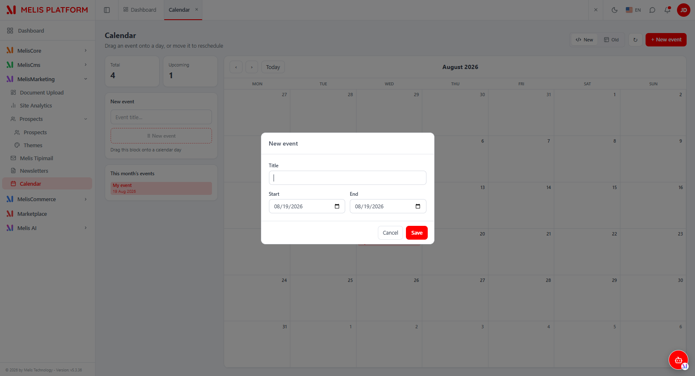
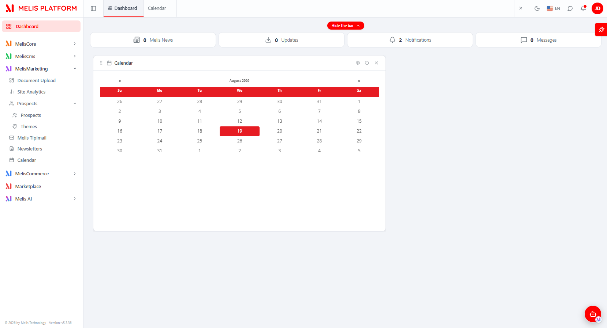
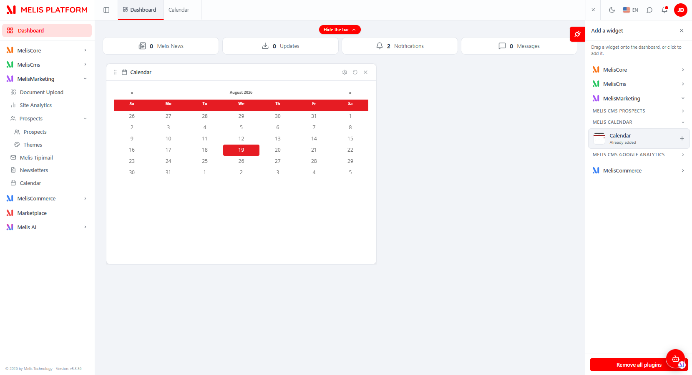

# MelisCalendar (React back-office) — Functional & Technical Documentation (for AI)

> **What this is.** MelisCalendar is the **calendar / event-scheduling** tool of Melis: dated
> events on an interactive month grid, drag-to-schedule and drag-to-reschedule. This document
> covers it **in the new React back-office** (`/melis-react`): the module ships a **native
> full-React brick** — a custom React month calendar with native drag-and-drop, reading and
> writing through a `react-api` JSON layer (`/melis/react-api/calendar-events…`) — plus a
> **New / Old toggle** that can fall back to the legacy tool in an iframe. For the underlying
> data model, the `MelisCalendarService` and the dashboard widget, see the
> [legacy tool doc](./MelisCalendar.md); this doc does not repeat them.
>
> **How this document is organised — two clearly separated parts:**
> - **[Part A — Functional Guide](#part-a--functional-guide)** — for everyday users (and the
>   chat assistant) using the React back-office. Plain language.
> - **[Part B — Technical Reference](#part-b--technical-reference)** — for developers and AI
>   building inside the React UI, with code (brick manifest, endpoints, capabilities).
>
> **Audience**: consumed by the **MelisAI** MCP. **Status**: reviewed 2026-08-19.

---

## 0. Where this lives in the React back-office — read this first

- **Brick kind: native full-React** (not an iframe brick). The whole UI is authored in React
  (`ui-react/src/CalendarPage.tsx`) — a custom **monthly** grid with native drag-and-drop — and
  reads/writes through `/melis/react-api/calendar-events…` endpoints defined in this module. It
  also keeps a **New / Old toggle**: *Old* renders the legacy tool in an iframe
  (`/melis/react-tool-page?key=meliscalendar_tool`), *New* is the React UI (default).
- **Where in the menu.** Sidebar → **MelisMarketing** group → **Calendar** (calendar icon). It
  opens as a top tab named **Calendar** (the manifest `label` is `Calendrier`; the shown label is
  translated by the host menu). The manifest `route` `/calendar` is only the fallback — the real
  mount is the menu tree route derived from `forwardKey` `MelisCalendar/Calendar`. The tool appears
  **only if the module is activated** (modular brick discovery, see §B5).
- **Single-level tool** (no host sub-tabs): one persistent page with a create/edit **modal**.
  Events are **platform-global** (a shared team agenda — not tied to a site/CMS).
- **Coupled surface.** A **Calendar Events** dashboard widget shows the same events on the
  back-office Dashboard — it is served by the legacy `MelisCalendarEventsPlugin`, see
  [MelisCalendar.md §B4](./MelisCalendar.md).

---
---

# PART A — Functional Guide

## A1. What you can do with MelisCalendar in the new back-office

- **Schedule events** — type a title and **drag it onto a day** to create the event on that day
  (or use **+ New event** for a form with explicit start/end dates).
- **Reschedule** — **drag an event** from one day to another; a multi-day event keeps its duration.
- **Edit / delete** — click an event to open its modal and change the title/dates or delete it.
- **Track at a glance** — KPI cards (**Total** / **Upcoming**) and a **This month's events** list.
- **Compare New vs Old** — switch the whole tool between the React UI and the classic tool with
  the **New / Old** toggle (top-right).
- **See events on the Dashboard** — add the **Calendar** widget from the dashboard's plugin selector.

## A2. Finding it in /melis-react

**Where:** left sidebar → **MelisMarketing** → **Calendar**. It opens as a top tab named **Calendar**.


*The React Calendar tool: New/Old toggle and "+ New event" (top-right), KPI cards (Total / Upcoming), the "New event" drag block and "This month's events" list (left), and a custom monthly grid (Mon→Sun) with today highlighted (19) and an event ("My event").*

## A3. Key words explained

- **Event** — a scheduled item: a **title** + a **start date** + an **end date** (dates only, no time).
  A single-day event has start = end.
- **Drag block** ("New event") — the dashed block in the left panel: type a title, then drag it onto
  a day to create the event there.
- **Reschedule** — moving an event to another day by dragging it on the grid (its duration is kept).
- **New / Old** — the two views of the same tool: **New** = the React calendar, **Old** = the classic
  FullCalendar tool in an iframe.
- **Upcoming** — the KPI counting events whose start date is today or later.

> For the domain glossary, the data model and the `MelisCalendarService`, see the
> [legacy doc](./MelisCalendar.md).

## A4. The monthly grid

The centre is a **custom month grid** (weeks Monday→Sunday, 6 rows). Use **‹ / ›** to change month,
**Today** to jump back to the current month; the current day is highlighted. Events appear as chips
on their day(s); a multi-day event spans several cells.


*A day cell (19, today) with an "My event" chip. Chips are draggable to reschedule; click one to edit.*

## A5. Creating an event — drag block or "+ New event"

**Fastest way:** in the left **New event** panel, type a title and **drag the dashed block onto a
day**. On touch devices, tap the block to "arm" it, then tap a day.


*The left "New event" panel: a title input plus the dashed drag block ("⠿ New event") with the hint "Drag this block onto a calendar day".*

**With explicit dates:** click **+ New event** (top-right) to open the modal and set **Title**,
**Start** and **End**.


*The event modal — Title, Start and End date pickers, Cancel / Save. Opening an existing event shows the same modal with a Delete button.*

> **Tip:** the title is required (≤ 255 chars); if **End** is before **Start** it is clamped to
> **Start** (an event's end is always ≥ its start).

## A6. Editing, rescheduling and deleting

- **Reschedule** → drag the event chip to another day (duration preserved).
- **Edit** → click the event (on the grid or in "This month's events") → change fields → **Save**.
- **Delete** → open the event → **Delete** → confirm.

## A7. The Calendar dashboard widget

On the back-office **Dashboard** you can add the **Calendar** widget to see events without opening
the tool. It is added from the dashboard's **plugin selector** (MELIS CALENDAR section).


*The Calendar widget on the React Dashboard — a compact month grid (Sun→Sat) with today (19) highlighted, plus its gear / refresh / close controls.*


*The dashboard "Add a widget" panel — the Calendar widget under the MELIS CALENDAR section (shown "Already added").*

## A8. Common tasks — "How do I…?"

- **Add an event on a day** → type a title in the left panel → drag the block onto that day.
- **Add an event with dates** → **+ New event** → fill Title / Start / End → **Save**.
- **Move an event** → drag its chip to another day.
- **Edit / cancel an event** → click it → edit fields → **Save**, or **Delete** → confirm.
- **Compare with the classic tool** → top-right **New / Old** toggle → **Old**.
- **See events on the Dashboard** → dashboard plugin selector → MELIS CALENDAR → **Calendar** widget.

---
---

# PART B — Technical Reference

## B1. React presence at a glance

| Item | Value |
|---|---|
| Brick kind | **Native full-React** (custom monthly calendar; with a New/Old legacy-iframe fallback) |
| Brick id | `calendar` (matches `brick.tsx` ⇄ `brick.manifest.json`) |
| Manifest `route` | `/calendar` (fallback; real mount is the menu tree route for `forwardKey`) |
| `label` | `Calendrier` (host translates the shown menu label) |
| `forwardKey` | `MelisCalendar/Calendar` |
| `melisKey` (manifest / Old-view iframe / rights + caps node) | `meliscalendar_tool` |
| `entry` | `brick.js` |
| `subTabs` | *(absent)* — single-level tool, no host sub-tabs |
| `persistent` | `true` (page kept mounted) |
| Access-guard / capabilities melisKey | `meliscalendar_tool` (leaf tool node — same key as the manifest) |
| API base | `/melis/react-api/calendar-events` |
| Table (owned) | `melis_calendar` — see [legacy doc §B2](./MelisCalendar.md) |
| Activation-gated | Yes (appears iff the module is in `config/melis.module.load.php`) |

## B2. The brick — anatomy

Source in `ui-react/` (Vite **IIFE**, React externalised to the host globals `MelisReact*`, output
to `public/ui-react/brick.js` next to `brick.manifest.json`).

`ui-react/src/brick.tsx` registers ONE routed component under the brick id:
```tsx
import CalendarPage from './CalendarPage'
window.__melisRegisterBrick?.({ id: 'calendar', Component: CalendarPage })  // id MUST match the manifest
```

Manifest (`public/ui-react/brick.manifest.json`):
```json
{
  "id": "calendar",
  "route": "/calendar",
  "label": "Calendrier",
  "forwardKey": "MelisCalendar/Calendar",
  "melisKey": "meliscalendar_tool",
  "entry": "brick.js",
  "persistent": true
}
```

React components (`ui-react/src/`):

| File | Role |
|---|---|
| `CalendarPage.tsx` | The whole tool: header (KPI, `ViewToggle`, refresh, "+ New event"), left panel ("New event" drag block + "This month's events" list), the custom **6-week month grid** with native **and** touch (Pointer Events) drag-drop, and the `EventModal` (create / edit / delete + confirm). Owns the **New/Old** `mode` and mounts the *Old* iframe. Self-contained i18n (fr/en from `document.documentElement.lang`), inline styles (theme CSS vars). |
| `EventModal` (in `CalendarPage.tsx`) | Create/edit form (Title / Start / End) with `FormErrorBanner`, plus a delete-confirm sub-modal. |
| `ViewToggle.tsx` | The reusable **New (React) / Old (iframe)** toggle (`type ViewMode = 'react' \| 'iframe'`). |
| `calendar-api.ts` | The API client (see §B3): `fetchEvents`, `fetchCalStats`, `saveEvent`, `deleteEvent` + `CalEvent`/`CalStats` types. |
| `shared/melis-form-errors.tsx` | `FormErrorBanner`, `koNotify`, `FormIssue` — shared form-error UI. |

> **Brick constraint:** the bundle externalises only React to the host globals; it cannot import host
> modules (Tailwind/shadcn/lucide/i18n), hence **inline styles + in-file i18n**. Capability checks go
> through the injected `window.MelisCan(melisKey, cap)` global; toasts via
> `window.postMessage({ __melisNotif: true, … })`.

## B3. React API — endpoints

Routes live in **`config/react-api.php`** (merged into the module via `MelisCalendar\Module::getConfig()`
with `ArrayUtils::merge`), controller **`MelisCalendar\Controller\MelisReactApiCalendarController`**
(invokable alias `MelisCalendar\Controller\MelisReactApiCalendar`). All under
`/melis/react-api/calendar-events`, contract `{ success, data, error }`. Dates are `YYYY-MM-DD` (no time).

| Method & URL | Action | Purpose |
|---|---|---|
| `GET /calendar-events[?from=&to=]` | `list` | Events overlapping the window `[from,to]` → `{ items: CalEvent[] }` (each `{id,title,start,end}`) |
| `GET /calendar-events/stats` | `stats` | KPI `{ total, ongoing, upcoming }` |
| `GET /calendar-events/:id` | `get` | One event `{id,title,start,end}` |
| `POST /calendar-events/save` | `save` | Create (no `id`) / update (with `id`) — title + start/end; also used for reschedule |
| `DELETE /calendar-events/delete/:id` | `delete` | Delete an event |

Example (from `calendar-api.ts`):
```ts
const XHR = { 'X-Requested-With': 'XMLHttpRequest' }

// list events in a window (returns .items)
const r = await fetch('/melis/react-api/calendar-events?from=2026-08-01&to=2026-08-31',
  { credentials: 'include', headers: XHR })
const { data } = await r.json()   // { items: [{ id, title, start, end }] }

// create OR reschedule/edit (omit id = create, include id = update)
await fetch('/melis/react-api/calendar-events/save', {
  method: 'POST', credentials: 'include',
  headers: { ...XHR, 'Content-Type': 'application/json' },
  body: JSON.stringify({ id: null, title: 'Kickoff', start: '2026-08-19', end: '2026-08-19' }),
})

// delete
await fetch('/melis/react-api/calendar-events/delete/42', { method: 'DELETE', credentials: 'include', headers: XHR })
```
Every fetch sends `X-Requested-With: XMLHttpRequest` + `credentials:'include'`.

> **Note on the data layer.** This controller talks to the `melis_calendar` table **directly via
> parameterised SQL** (`Laminas\Db\Adapter\AdapterInterface`), reproducing the legacy rules (title
> required ≤255, `end` clamped to `start` when earlier, `cal_created_by`/`cal_last_update_by` audit
> from `MelisCoreAuth`). The higher-level `MelisCalendarService` (legacy doc §B3) is **not** used by
> this controller. **Route order matters** in `react-api.php`: `/stats`, `/save`, `/delete/:id` are
> declared before the catch-all `/:id`.

## B4. Capabilities (advanced rights)

Declared in **`config/react.capabilities.php`** under the **leaf tool node** `meliscalendar_tool`
(NOT the parent group `meliscalendar_leftnemu`, which — having a child — renders as a group without
caps). The same key is the controller's access-guard melisKey **and** the front `can()` key.

```php
return [
    'melisReactToolCapabilities' => [
        'meliscalendar_tool' => ['create', 'edit'],
    ],
];
```

**Only two capabilities** (no separate `list`/`delete`):
- **`create`** — create an event (drag a new title onto a day / "+ New event").
- **`edit`** — move/reschedule (drag), edit **or** delete an existing event.

> ⚠ **Viewing the calendar requires `create` OR `edit`** (either is enough). A user with only
> `create` sees the calendar and can add events, but cannot move/edit/delete. This "at least one of"
> rule is enforced server-side by `denyUnlessCanAny(['create','edit'])` on `list`/`stats`, and in the
> UI by `can('create') || can('edit')`.

Each controller action is guarded twice (auth+access, then capability):
```php
private const MELIS_KEY = 'meliscalendar_tool';

// read (list / stats): auth + access, then "create OR edit"
if ($deny = $this->denyUnlessAccess())              { return $deny; }     // 401/403 via MelisCoreRights::canAccess(MELIS_KEY)
if ($denyCap = $this->denyUnlessCanAny(['create','edit'])) { return $denyCap; }

// save: create when no id, edit when id present
if ($denyCap = $this->denyUnlessCan($id ? 'edit' : 'create')) { return $denyCap; }

// delete: edit (no distinct delete right)
if ($denyCap = $this->denyUnlessCan('edit')) { return $denyCap; }
```
`denyUnlessCan` comes from `MelisReactApi\Controller\CapabilityGuardTrait`; `denyUnlessCanAny` is a
local OR-variant using `MelisReactApi\Service\Capabilities::isAllowed`. Both are **default-allow**
(undeclared tool/cap allowed) and **admin-bypass**. In React, `can(cap)` calls
`window.MelisCan('meliscalendar_tool', cap)` (defaults to `true` when the resolver is absent).

## B5. Host integration

- **Discovery / gating.** `GET /melis/react-api/react-modules` lists active modules that ship a
  `brick.manifest.json`; the host (`melis-core/ui-react/src/lib/bricks.ts`) loads `brick.js` (shared
  React globals) and mounts the brick. Removing `MelisCalendar` from `config/melis.module.load.php`
  makes it disappear.
- **Menu → route.** `useNavMenu` maps the `forwardKey` `MelisCalendar/Calendar` to the tool's menu
  tree route; `Component: CalendarPage` renders there. No sub-tabs (`subTabs` absent).
- **New/Old toggle.** `CalendarPage` holds the `mode` state; in **Old** mode it mounts an iframe to
  `/melis/react-tool-page?key=meliscalendar_tool` (`MelisReactOverride`) — `meliscalendar_tool` is the
  rendable legacy zone (`follow_regular_rendering:false` in `config/app.interface.php`). The iframe is
  kept mounted once opened (`display:none` when back to New).
- **Notifications.** Success/error toasts are dispatched via
  `window.postMessage({ __melisNotif: true, kind, title, message }, '*')` (the host toast bridge).
- **i18n.** The brick reads the active language from `document.documentElement.lang` (session locale,
  set by the host) and ships an in-file `{fr,en}` dictionary; dates via `Intl` (`fr-FR`/`en-GB`).
- **Generic bits stay in `melis-react-api`.** `CapabilityGuardTrait` + the `Capabilities` resolver are
  generic (always loaded); the tool's controller/routes/caps live **in this module** (modularity rule).
- **Dashboard widget** stays legacy (`MelisCalendarEventsPlugin`) — see [MelisCalendar.md §B4](./MelisCalendar.md).

## B6. Quick code map

```
melis-calendar/
├── config/
│   ├── react-api.php            routes (/melis/react-api/calendar-events…) + invokable → MelisReactApiCalendar
│   └── react.capabilities.php   melisReactToolCapabilities keyed on meliscalendar_tool → [create, edit]
├── src/
│   ├── Module.php               getConfig() merges react-api.php + react.capabilities.php (ArrayUtils::merge)
│   └── Controller/
│       └── MelisReactApiCalendarController.php   list/stats/get/save/delete, direct SQL on melis_calendar
│                                                 denyUnlessAccess + denyUnlessCan(Any), MELIS_KEY=meliscalendar_tool
├── ui-react/                    Vite IIFE brick (React external)
│   └── src/  brick.tsx (registers id 'calendar') · CalendarPage.tsx (grid + drag-drop + EventModal)
│            · ViewToggle.tsx (New/Old) · calendar-api.ts (client) · shared/melis-form-errors.tsx
├── public/ui-react/             brick.js (built) + brick.manifest.json (id/route/label/forwardKey/melisKey/persistent)
└── etc/MelisAI/doc/             MelisCalendar.md (legacy) · MelisCalendar-react.md (this) · images/ · images/react/
```

> Business logic stays server-side (parity with the legacy tool); React = presentation + API calls.
> Underlying data model, `MelisCalendarService`, the `meliscalendar_save_event_end` event and the
> dashboard widget: [MelisCalendar.md](./MelisCalendar.md).

---

## Screenshot index

Filename → content lookup for the MelisAI MCP. All under `./images/react/`.

| Image file | Content |
|---|---|
| `meliscalendar-tool-calandar-display.png` | React Calendar tool — New/Old toggle, "+ New event", KPI cards (Total/Upcoming), "New event" drag block, "This month's events" list, custom monthly grid |
| `meliscalendar-tool-calandar-event.png` | A day cell (today, 19) with an event chip on the grid |
| `meliscalendar-tool-calandar-new-event.png` | The left "New event" panel — title input + dashed drag block with the drag hint |
| `meliscalendar-tool-calandar-event-edition.png` | The event modal — Title, Start, End date pickers, Cancel/Save (Delete when editing) |
| `meliscalendar-dashboardplugins-calandar.png` | The Calendar dashboard widget — compact month grid with today highlighted |
| `meliscalendar-dashboardplugins-menu-selector.png` | Dashboard "Add a widget" panel — Calendar widget under the MELIS CALENDAR section |

---

*Document for AI consumption (MelisAI MCP) — React back-office of `melisplatform/melis-calendar`.
Part A = functional guide for users; Part B = technical reference with examples for developers/AI.
Legacy tool doc: [./MelisCalendar.md](./MelisCalendar.md). Last reviewed 2026-08-19.*
