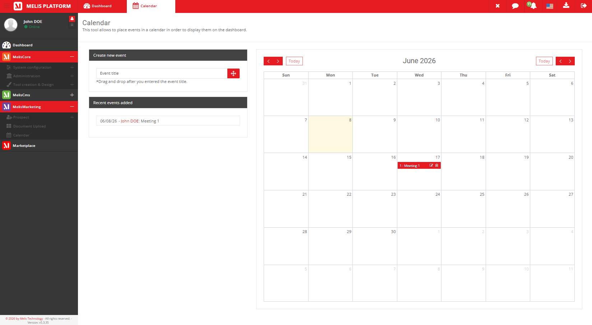
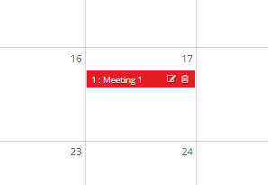
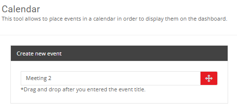
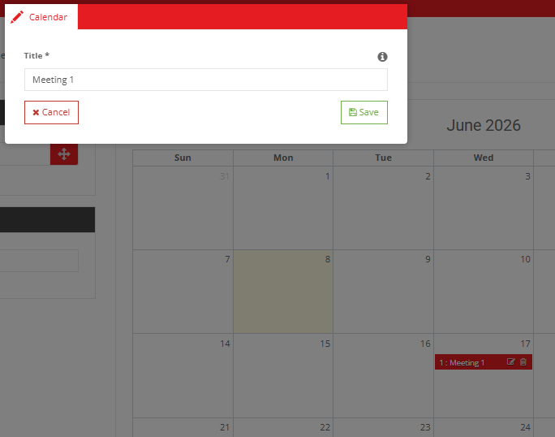
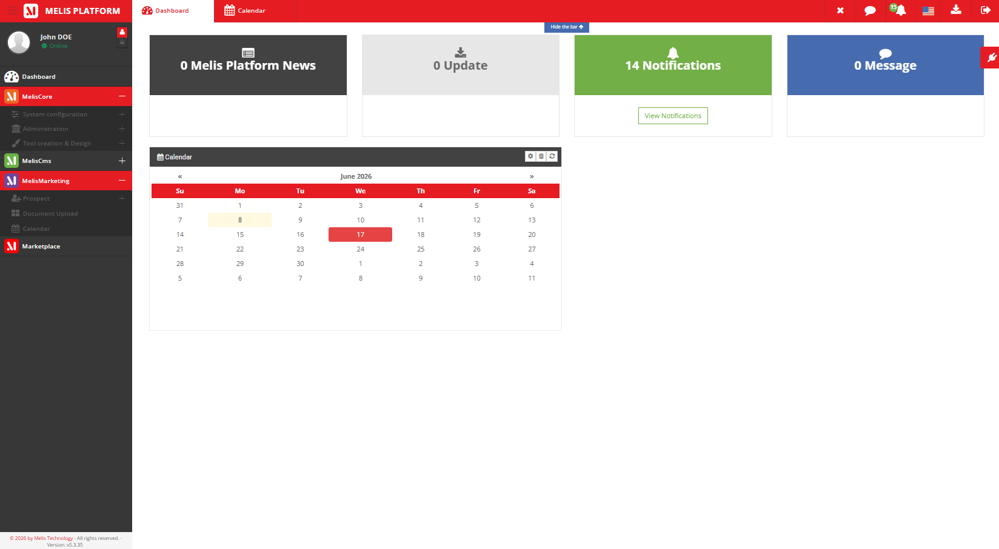
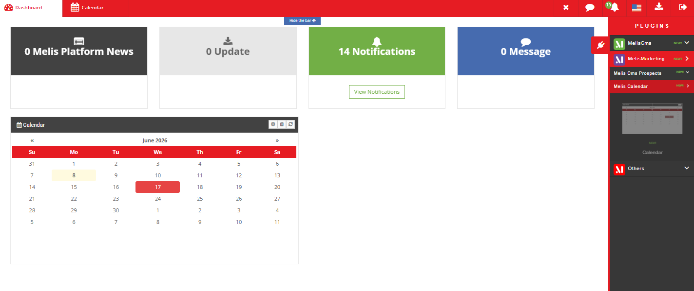

# MelisCalendar Module — Functional Documentation (for AI)

> **Purpose of this document**: describe, functionally and technically, the
> `melisplatform/melis-calendar` module, so that an AI (or a developer) can understand
> *what the module does*, *which tools it provides*, *how they work* and
> *where the corresponding code lives*.
>
> **Audience**: consumed by the **MelisAI** module (a MelisPlatform module that exposes an
> MCP function to answer user questions). MelisAI fetches this `.md` file and the
> screenshots in `./images/` **on demand** — so the doc is self-contained and §9 acts as
> the filename→content index for retrieving a specific screenshot.
>
> **Status**: reviewed 2026-06-08 against the current source. The module carries no
> semantic version (no `version` in `composer.json`), so treat this doc as describing the
> current `melisplatform/melis-calendar` source rather than a tagged release.
>
> Screenshots live in `./images/` (relative paths `./images/...`).

---

## 1. Overview

`MelisCalendar` provides a **calendar / event scheduling tool** and a **dashboard widget**
to help schedule and track events on the Melis platform. Editors create dated events in an
interactive calendar (built on **FullCalendar**), drag them to reschedule, and see upcoming
events at a glance on the back-office dashboard. The module also exposes a **service** so
other modules can create events programmatically.

| Item | Value |
|---|---|
| Package name | `melisplatform/melis-calendar` |
| Type | `melisplatform-module` |
| PHP namespace | `MelisCalendar\` → `src/` (PSR-4) |
| Melis category | `core` |
| License | OSL-3.0 |
| PHP required | `^8.1 | ^8.3` |
| Framework | Laminas (ex-Zend Framework 2/3), Melis MVC architecture |
| dbdeploy | `true` (DB migrations applied automatically) |
| Calendar UI | **FullCalendar** (+ Moment.js) — `public/plugins/full-calendar/` |

### Dependencies (required Melis modules)

Declared in `composer.json`:

- `melisplatform/melis-core` (`^5.2`) — foundation, services, events, rights, translations,
  back-office dashboard

This is a **core-category** module: unlike the CMS modules, it depends only on `melis-core`
(no `melis-cms`), so it is not tied to sites/pages — events are platform-global.

---

## 2. Functional concepts

- **Event**: a dated entry with a **title** and a **start** and **end** date, plus audit
  fields (who created it, who last updated it, and when). Events are **platform-wide** (not
  scoped to a site).
- **Calendar view**: events are shown in an interactive FullCalendar; they can be **dragged
  to reschedule** (which updates their dates) and clicked to **edit**.
- **Dashboard widget**: a compact view of events surfaced on the Melis back-office dashboard.

### Data model (MySQL table)

| Table | Role | Primary key |
|---|---|---|
| `melis_calendar` | An event: `cal_event_title`, `cal_date_start`, `cal_date_end`, and audit (`cal_created_by`, `cal_last_update_by`, `cal_date_last_update`, `cal_date_added`) | `cal_id` |

- MySQL Workbench model: `install/sql/Model/MelisCalendar.mwb`
- Base structure: `install/sql/setup_structure.sql`
- Incremental migrations: `install/dbdeploy/*.sql`, `install/sql/dbdeploy/*.sql`

---

## 3. Tools and elements provided

The module exposes:

1. **The Calendar tool (back-office)** — interactive calendar + create form + recent list
2. **A dashboard plugin** — Calendar Events widget
3. **An application service** to add / reschedule / delete events
4. **A draggable form element** used by the calendar UI

---

### 3.1 Calendar tool (back-office)

Accessible from the Melis back-office left menu, **MelisMarketing** tools tree section
(icon `fa fa-calendar`). Declared in `config/app.interface.php` (keys
`melistoolcalendar_cof` / `melistoolcalendar_tool`).

- **Controllers**: `src/Controller/CalendarController.php` (views/render actions) and
  `src/Controller/ToolCalendarController.php` (data + write actions)
- **Views**: `view/melis-calendar/calendar/*.phtml`
- **Form**: `melicalendar_event_form` (`config/app.forms.php`) — event title + start/end dates

The tool screen is composed of three render areas (declared under `melistoolcalendar_tool`):
- **Calendar content** (`renderCalendarToolCalendarContentAction`, JS `initCalendarTool()`)
  — the **FullCalendar** grid showing events; events are fed by AJAX
  (`retrieveCalendarEventsAction`).
- **Create form** (`renderCalendarToolCreateFormAction`) — add a new event (title + dates).
- **Recently added** (`renderCalendarToolRecentAddedAction`) — a list of the latest events.

Interactions (handled by `ToolCalendarController`):
- **Create / save**: `saveEventAction` → `MelisCalendarService::addCalendarEvent()`
- **Reschedule** (drag / resize on the calendar): `reschedEventAction` →
  `MelisCalendarService::reschedCalendarEvent()`
- **Edit**: the edit-event modal (`renderCalendarEditEventModalAction`, interface key
  `meliscalendar_tool_edit_event_modal`); `getEventTitleAction` fetches an event's data
- **Delete**: `deleteEventAction` → `MelisCalendarService::deleteCalendarEvent()`
- **Search**: `searchCalendarEventAction`


*Caption: the Calendar tool — the interactive FullCalendar grid of events (draggable to
reschedule), the create-event form and the recently-added events list.*


*Caption: an event shown on the calendar grid after creation.*


*Caption: the create-event form — event title and start/end dates.*


*Caption: the edit-event modal — update an existing event's title and dates (or delete it).*

---

### 3.2 Dashboard plugin — Calendar Events

- **Plugin**: `src/Controller/DashboardPlugins/MelisCalendarEventsPlugin.php` (`calendarEvents`)
- **Config**: `config/dashboard-plugins/MelisCalendarEventsPlugin.config.php`
- **View**: `view/melis-calendar/dashboard-plugins/calendar-events.phtml`
- Adds a **Calendar Events** widget to the MelisCore back-office Dashboard (section
  *MelisMarketing*, icon `fa fa-calendar`, JS callback `initDashboardCalendar()`). Its data
  comes from `ToolCalendarController::retrieveDashboardCalendarEventsAction`.


*Caption: the Calendar Events dashboard widget — a compact calendar/list of events on the
back-office dashboard.*


*Caption: the dashboard's plugin selector (MelisMarketing section) where the Calendar Events
widget is picked and added to the dashboard.*

---

### 3.3 Application service `MelisCalendarService`

- **File**: `src/Service/MelisCalendarService.php`
- **Service manager alias**: `MelisCalendarService`

Usage from another module (e.g. to add events programmatically):

```php
$calendarService = $this->getServiceManager()->get('MelisCalendarService');
$calendarService->addCalendarEvent($postValues); // title + start/end dates
```

Public methods:

| Method | Role |
|---|---|
| `addCalendarEvent($postValues)` | Create an event |
| `reschedCalendarEvent($postValues)` | Move/resize an event (update its dates) |
| `deleteCalendarEvent($postValues)` | Delete an event |

#### Service event

A `meliscalendar_save_event_end` event is fired when an event is saved — other modules can
`attach()` to it to run custom code after a save (see README example).

#### Table (Table Gateway)

Declared as alias in `config/module.config.php`: `MelisCalendarTable`
(→ `melis_calendar`), in `src/Model/Tables/`.

---

### 3.4 Draggable form element

- `MelisCalendarDraggableInput` — factory
  `src/Form/Factory/MelisCalendarDraggableInputFactory.php` (registered in
  `config/module.config.php`). A drag-and-drop input used by the calendar UI to drag events
  onto the FullCalendar grid.

---

## 4. Extensions and integrations

### 4.1 Listener (`src/Listener/`)

| Listener | Role |
|---|---|
| `MelisCalendarFlashMessengerListener` | Back-office interface flash messages (attached only on the back-office route) |

### 4.2 Diagnostic

- `config/diagnostic.config.php` — module health checks (Melis diagnostic system).

---

## 5. Front assets

Declared in `config/app.interface.php` (key `ressources`) and module config:

- **Calendar library**: `public/plugins/full-calendar/` (FullCalendar) +
  `public/plugins/moment/moment.min.js`
- **JS (tool)**: `public/js/tools/calendar-tool.js`
- **CSS**: `public/css/calendar.css` + `public/plugins/fullcalendar.css`
- **Compiled bundle**: `public/build/css/bundle.css`, `public/build/js/bundle.js`

---

## 6. Internationalization

- Translation files: `language/en_EN.interface.php`, `language/fr_FR.interface.php`,
  `language/en_EN.forms.php`, `language/fr_FR.forms.php`
- Interface keys use the `tr_melistoolcalendar_*` / `tr_meliscalendar_*` prefixes.
- Translation loading: `Module::createTranslations()` (loads `interface` + `forms` types).

---

## 7. Quick code map

```
melis-calendar/
├── composer.json                 → module dependencies & metadata (category: core, dbdeploy: true)
├── config/
│   ├── module.config.php         → routes, service, table, controllers, form element, dashboard plugin
│   ├── app.interface.php         → back-office menu + the Calendar tool layout (MelisMarketing section)
│   ├── app.forms.php             → the event form (title + dates)
│   ├── app.tools.php             → tool configuration
│   ├── diagnostic.config.php     → diagnostic tests
│   └── dashboard-plugins/        → Calendar Events dashboard plugin config
├── src/
│   ├── Module.php                → bootstrap, flash listener, translations
│   ├── Controller/               → CalendarController, ToolCalendarController, DashboardPlugins/
│   ├── Service/                  → MelisCalendarService (add/resched/delete)
│   ├── Model/Tables/             → MelisCalendarTable
│   ├── Listener/                 → MelisCalendarFlashMessengerListener
│   └── Form/Factory/             → MelisCalendarDraggableInputFactory
├── view/                         → .phtml templates (calendar tool, edit modal, dashboard)
├── public/                       → FullCalendar + Moment.js, tool JS/CSS, bundles
├── language/                     → en_EN / fr_FR (interface + forms)
├── install/                      → SQL (structure, MWB model, dbdeploy migrations)
└── etc/                          → MarketPlace (xml) + MelisAI/doc (this doc)
```

---

## 8. Typical event lifecycle

1. **Open** the Calendar tool (back-office → MelisMarketing → Calendar).
2. **Create** an event via the create form (title + start/end dates) → `saveEventAction` →
   `addCalendarEvent()` → `melis_calendar`.
3. **Reschedule** by dragging/resizing the event on the FullCalendar grid → `reschedEventAction`
   → `reschedCalendarEvent()`.
4. **Edit** an event through the edit modal, or **delete** it (`deleteEventAction`).
5. **Track**: the recently-added list and the **Calendar Events dashboard widget** surface
   upcoming/recent events.
6. **From other modules**: call `MelisCalendarService::addCalendarEvent()` to add events
   programmatically; hook `meliscalendar_save_event_end` to react to saves.

---

## 9. Screenshot index (for on-demand retrieval)

All screenshots live in `./images/` (i.e. `/etc/MelisAI/doc/images/`). This table is the
**filename → content** index the MelisAI MCP uses to fetch a specific screenshot on demand;
each row's caption in the body gives the text-only description of what the image shows.

| Image file | Content |
|---|---|
| `meliscalendar-tool-calandar-display.png` | Calendar tool — the FullCalendar view (events, create form, recent list) |
| `meliscalendar-tool-calandar-event.png` | Calendar tool — an event shown on the calendar |
| `meliscalendar-tool-calandar-new-event.png` | Calendar tool — create-event form (title + dates) |
| `meliscalendar-tool-calandar-event-edition.png` | Calendar tool — edit-event modal |
| `meliscalendar-dashboardplugins-calandar.png` | Calendar Events dashboard widget |
| `meliscalendar-dashboardplugins-menu-selector.png` | Dashboard plugin selector — adding the Calendar Events widget |

---

*Document for AI consumption (MelisAI MCP) — describes the `melisplatform/melis-calendar`
module. Last reviewed 2026-06-08 against the current source.*
